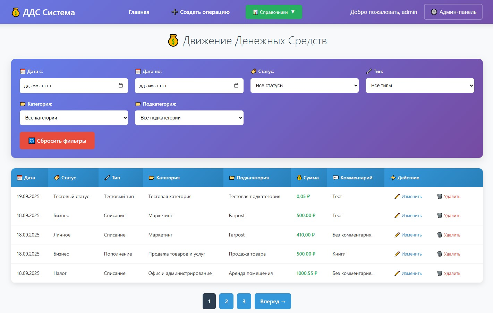
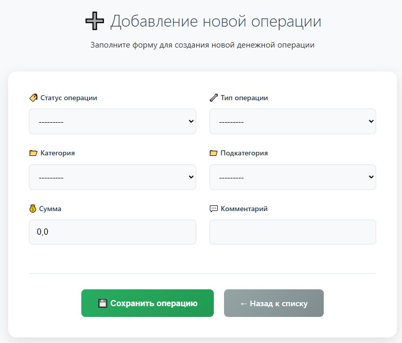
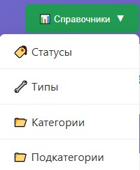
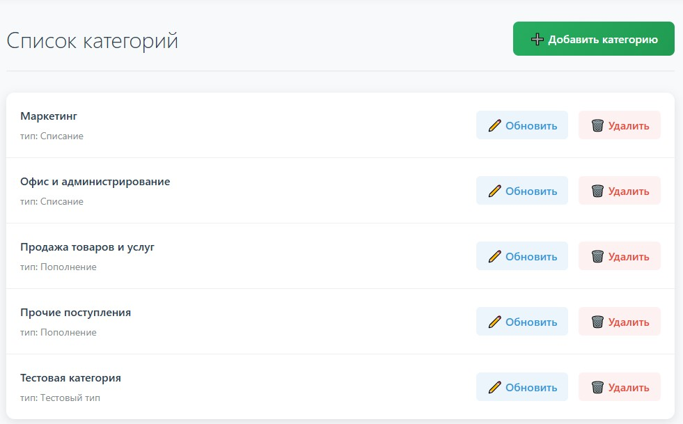
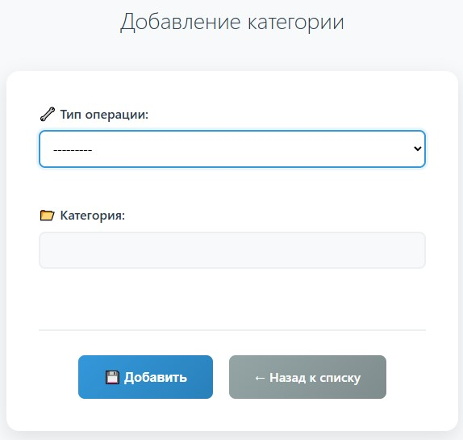
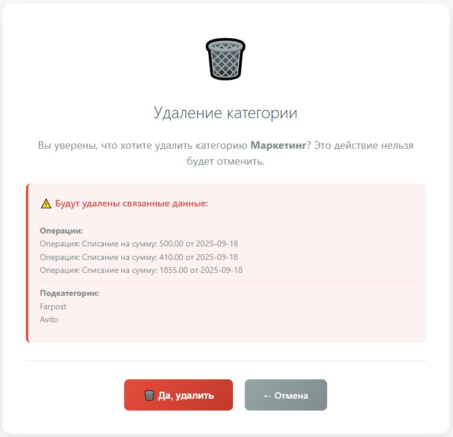

# Движение денежных средств (ДДС) - Веб-приложение

Веб-приложение для учета, управления и анализа движения денежных средств компании или частного лица.

## 🛠 Технологии

### ⚙️ Backend
- **Framework**: Django (Python 3.12)  
[](https://www.python.org/)
[](https://www.djangoproject.com/)
[](https://www.django-rest-framework.org/)

### 🌐 Frontend
- **Шаблонизация**: Django Templates + Jinja2  
[](https://docs.djangoproject.com/en/stable/topics/templates/)
 

### 🗄️ База данных
- **База данных**: SQLite  
[](https://www.sqlite.org/)

---

**Полный стек:** Django • Django REST Framework • Django Templates • Jinja2 • PostgreSQL • Docker • Docker Compose • Nginx • Gunicorn • Celery • Redis • GitHub Actions
## 📦 Установка
1) **Создать папку, например web_app и перейти в нее:**
```bash
    mkdir web_app
    cd web_app
```
2) **Склонировать проект с репозитория:**
```bash
    git clone https://github.com/scorp5438/CashFlow.git
```
3) **Перейти в папку CashFlow:**
```bash
    cd CashFlow
```
4) **Создать и активировать виртуальное окружение:**  
В Linux:
```bash
    python3 -m venv .venv
    source .venv/bin/activate
```
В Windows:
```bash
    python -m venv .venv
    myenv\Scripts\activate.bat
```
**Важно** Деактивация виртуального окружения для обоих ОС:
```bash
  deactivate
```
5) **Перейти в папку с приложением web_platform:**
```bash
    cd web_platform
```
6) **Установить зависимости:**
```bash
    pip install -r requirements.txt 
```
7) **Установить миграции:**
```bash
    python manage.py migrate
```
8) **Загрузить фикстуры из файла data.json(опционально):**
```bash
    python manage.py loaddata data.json
```
9) **Создать суперпользователя (опционально, для доступа в админ-панель Django):**
*В фикстрах есть суперпользователь*
```bash
    python manage.py createsuperuser
```
Ввести следующие данные:
- Имя пользователя
- Почту (опционально)
- Пароль
- Повторить пароль  
*Если пароль простой и вы согласны, нажать y*
10) **Запустите сервер разработки:**
```bash
  python manage.py runserver
```
11) **Приложение будет доступно по адресу:**
* Главная страница: http://127.0.0.1:8000
* Административная панель Django: http://127.0.0.1:8000/admin

### Фикстуры содержат:
- **Типы**
  - Пополнение
  - Списание
  - Тестовый тип
- **Статусы**
  - Бизнес
  - Личное
  - Налог
  - Доп. расходы
  - Тестовый статус
- **Категории**
  - Маркетинг
  - Офис и администрирование
  - Продажа товаров и услуг
  - Прочие поступления
  - Тестовая категория
- **Подкатегории**
  - Farpost
  - Avito
  - Аренда помещения
  - Канцелярия и расходники
  - Хозяйственные товары
  - Продажа товара
  - Возврат подотчетных средств
  - Проценты по вкладу
  - Оказание услуги
  - Тестовая подкатегория
- **Некоторое количество операций**
- **Суперпользователь**
  - Логин: admin
  - Пароль: 1324

## 🖥️ Интерфейс и функционал

Приложение предоставляет следующий функционал:

### Управление записями ДДС
*   **Создание, редактирование, удаление и просмотр записей**
*   Автоматическое заполнение даты с возможностью ручного изменения
*   Учет статусов (Бизнес, Личное, Налог и др.)
*   Разделение на типы операций (Пополнение, Списание и др.)
*   Категории и подкатегории с иерархической структурой
*   Учет суммы и комментариев

### Главная страница и фильтрация

* Отображает таблицу со списком всех финансовых операций.
* Реализована **пагинация** (по 5 записей на страницу).
* Над таблицей расположена система **фильтров**:
    * По дате (можно выбрать период "с" и "по").
    * По статусу (Бизнес, Личное, Налог и др.).
    * По типу операции (Пополнение, Списание).
    * По категории и подкатегории.
* В верхней навигационной панели доступны ссылки на основные разделы.



### Создание новой операции

* Доступно по кнопке **"Создать операцию"**.
* Форма включает следующие поля:
    * `Дата` (заполняется автоматически, но можно изменить)
    * `Статус` (выбор из справочника)
    * `Тип` (выбор из справочника)
    * `Категория` (список динамически обновляется в зависимости от выбранного Типа)
    * `Подкатегория` (список динамически обновляется в зависимости от выбранной Категории)
    * `Сумма` (обязательное поле)
    * `Комментарий` (необязательное текстовое поле)
* Реализована валидация данных на стороне клиента и сервера.



### Управление справочниками

* В выпадающем меню **"Справочник"** доступны разделы для управления базовыми сущностями:
    * **Статусы**
    * **Типы**
    * **Категории**
    * **Подкатегории**
* В каждом разделе можно просматривать список существующих записей, а также создавать новые, редактировать или удалять существующие.
* Для Категорий указывается привязка к Типу.
* Для Подкатегорий указывается привязка к Категории.

  
  
   
   

## 📌 API Endpoints  
- GET /api/category/ —— список категорий (фильтрация /api/category/?type=2)
- GET /api/subcategory/ —— список подкатегорий (фильтрация /api/subcategory/?category=2)

## 🔧 Логические зависимости

Приложение строго соблюдает заданные бизнес-правила:
1.  В форме создания операции список **Категорий** фильтруется и отображает только те, которые привязаны к выбранному **Типу**.
2.  Список **Подкатегорий** фильтруется и отображает только те, которые привязаны к выбранной **Категории**.
3.  Пользователь не может отправить форму, не заполнив обязательные поля.
